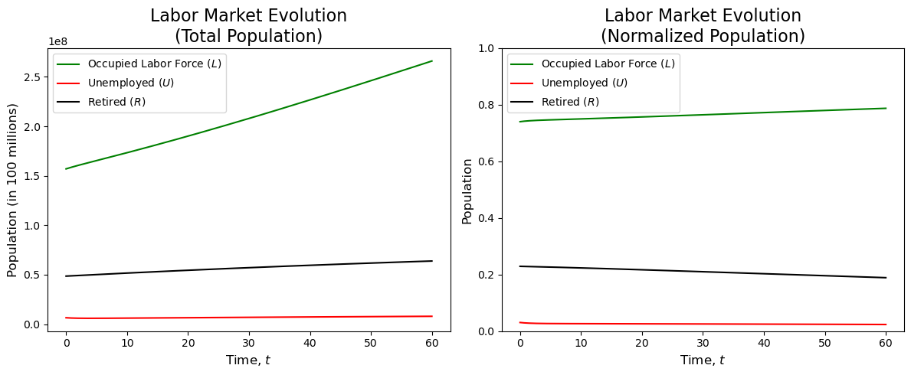
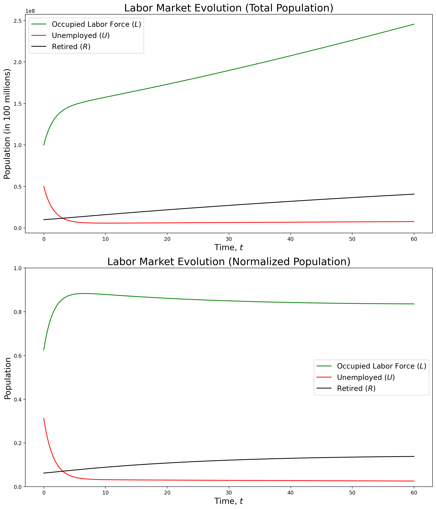
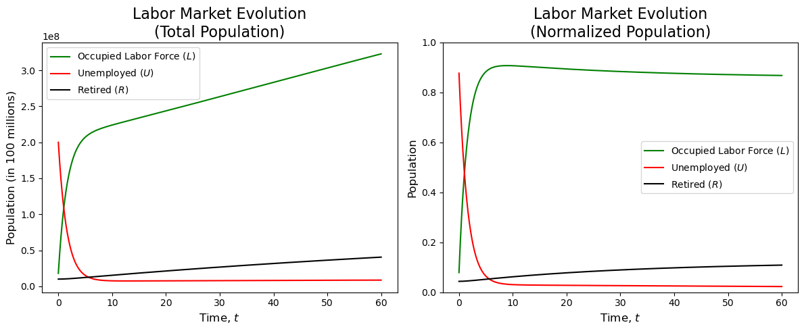
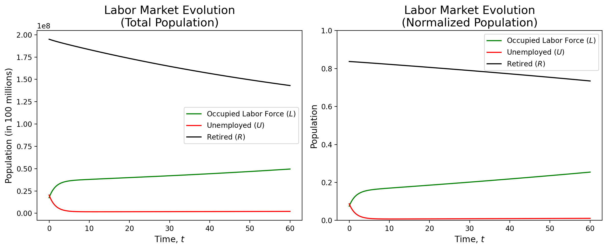
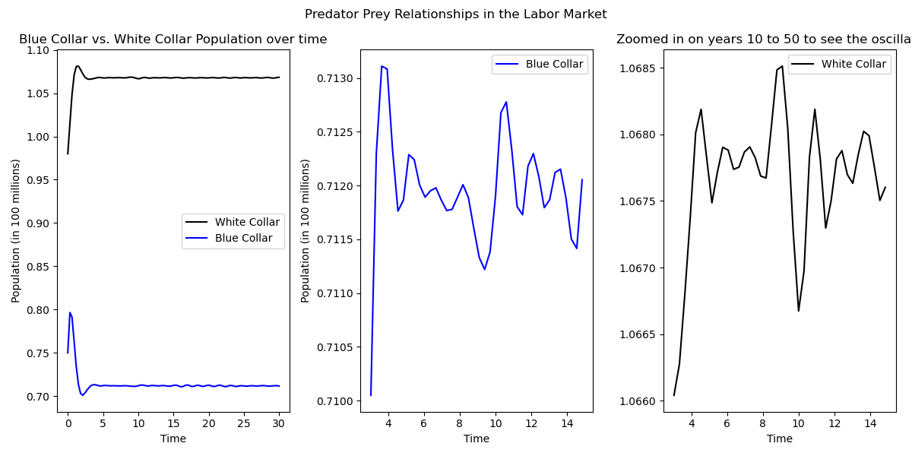
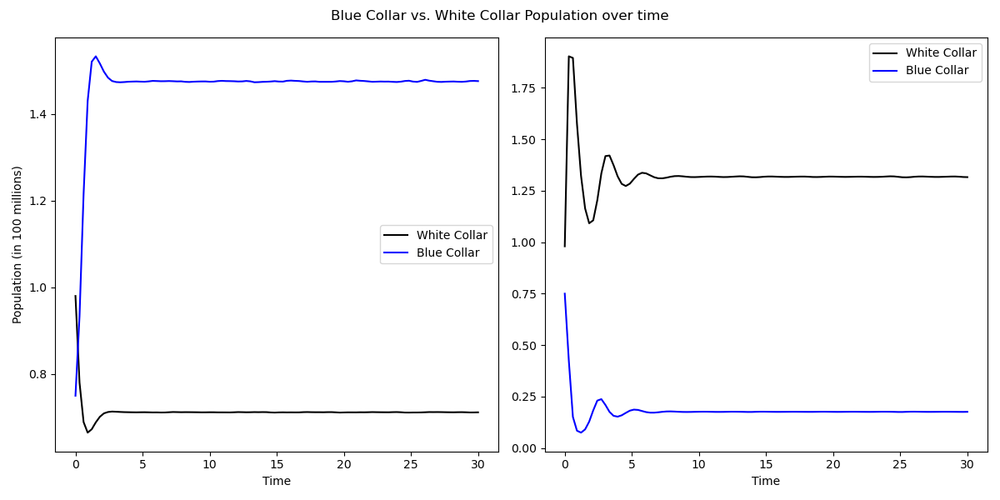

# InflationDynamics
Using Ordinary Differential Equations (ODEs) to model inflation compared to monetary policy in the United States. This is our Volume 4 project, started fall 2023.

## Abstract

The labor market, including the unemployment rate and the amount of workers looking for jobs, can have a large impact on the economy.
    The more people employed means more money being spent, which in turn means more money being made. 
    Furthermore, rise in unemployment can lead to a recession. Being able to predict the labor market can help us prepare for a recession and help us understand the economy better.
    In this paper, we adapt an SIR model to characterize the dynamics of employed, unemployed, and retired individuals in the labor market. 
    Additionally, we employ a quasi predator-prey model to illustrate the oscillatory behavior observed in the white-collar and blue-collar industries. 
    By comparing the SIR model to the predator-prey model, we aim to enhance our understanding of the complex interactions within the labor market, 
    providing potential insights for recession prediction and economic analysis.

## Background/Motivation

One thing that is certain in life is that people will always need jobs. Not only this, but people 
will often lose their jobs. Furthermore, people will (eventually) retire from their jobs.
The focus of our project is modeling this situation.

In recent studies exploring the complexities of employment trajectories and occupational sectors, researchers 
have employed various modeling approaches such as Agent-Based Modeling <a href='#9'>[9]</a>, and Markov Chains <a href='#14'>[14]</a>. However, 
in a departure from conventional methodologies, our investigation takes an innovative turn by adapting 
the SIR (Susceptible-Infectious-Recovered) model <a href='#5'>[5]</a>, typically utilized for studying disease dynamics, to the 
realm of employment dynamics. This unique application aims to unravel the intricate propagation of employment 
statuses, specifically delving into the transitions between being employed, unemployed, and retired.

A discernible trend has emerged in recent times, 
notably influenced by the technological revolution. The surge in interest and demand for tech-oriented careers 
has prompted a significant shift away from traditional blue-collar professions. This migration has led to a 
dual challenge: a scarcity of skilled workers in the blue-collar sector and an oversaturation of the tech 
industry <a href='#3'>[3]</a>. To capture this relationship between white and blue collar jobs, we also create a quasi-predator-prey 
framework inspired by ecological models, which offers insights into the cyclical dynamics between these sectors. 

Motivated by the imperative to comprehend and address the consequences of this evolving employment landscape, 
our research aims to contribute valuable insights for informing strategic policies and industry interventions. 
By analyzing the strengths of both the predator-prey framework and the SIR model, we aspire to provide a 
comprehensive understanding of the intricate dynamics shaping the contemporary employment scenario.

## Modeling

### Theoretical Framework

The Susceptible-Infectious-Recovered (SIR) model, developed by Kermack and McKendrick in 1927 <a href='#5'>[5]</a>, 
is a foundational mathematical framework for understanding the spread of infectious diseases in populations. 
It divides individuals into susceptible, infectious, and recovered compartments, capturing the dynamics of disease transmission.
In our model, we adapt the SIR model to represent the dynamics of the employment market through the labor force,
unemployed, and retired populations.

### Previous Work

We begin by building off the work of ElFadily et. al. <a href='#2'>[2]</a>. In their work, ElFadily et. al. proposed a model
 representing the labor force and unemployed populations. They begin by defining their equations as

$$\frac{dL}{dt} = \gamma U - (\sigma + \mu)L, \quad \frac{dU}{dt} = \rho \left(1 - \frac{L_{\tau} + U_{\tau}}{N_c} \right)L_{\tau} + \sigma L - (\gamma + \mu)U,$$

where $L$ is the labor force, $U$ is the unemployed population, with initial conditions for (1) defined as:

$$L(0) > 0, \quad U(0) > 0,$$

$$(L(\theta),U(\theta)) = (\varphi_1(\theta), \varphi_2(\theta)), \quad \theta \in [-\tau,0],$$

where $\varphi_i\in C([-\tau, 0], \mathbb{R}^+),$  $i=1,2$.

The parameters are defined as follows:

* $\gamma$: employment rate
* $\sigma$: rate of job loss 
* $\mu$: mortality rate
* $\rho$: maximum population growth rate 
* $N_c$: population carrying capacity 
* $\tau$: time lag needed to contribute in the reproductive process of a new individual looking for a job

### Modifications: The Retirement Group

With this information in mind, we can begin to adapt this model to fit our desired model structure. We begin by adding a third population, the retired population, $R$.
We can then define our new equations as

$$\frac{dL}{dt} = \gamma U - (\sigma + \mu)L {\color{red} - \left(\frac{\Sigma}{L + U}\right) L + \omega\left(\frac{\Sigma}{L + U}\right) R + \rho L},$$

$$\frac{dU}{dt} = \rho\left(1 - \frac{L + U}{N_c} \right)L + \sigma L -(\mu + \gamma)U,$$

$$\frac{dR}{dt} = {\color{red}\left(\frac{\Sigma}{L + U}\right) L - \omega\left(\frac{\Sigma}{L + U}\right) R - \mu R},$$

which simplify to 

$$\frac{dL}{dt} = \gamma U - (\sigma + \mu)L {\color{red} + (\omega R - L)\left(\frac{\Sigma}{L + U}\right) + \rho L},$$
        
$$\frac{dU}{dt} = \rho\left(1 - \frac{L + U}{N_c} \right)L + \sigma L -(\mu + \gamma)U$$
        
$$\frac{dR}{dt} = {\color{red}(L - \omega R)\left(\frac{\Sigma}{L + U}\right) - \mu R}.$$

One of the first things to note from our equations is the removal of the time lag $\tau$. 
This is because, instead of factoring in people when they are born, we are instead factoring them
in when they turn of working age (for simplification, age 16). This reduces unnecessary complexity in our model. 
Additionally, we make two assumptions about unemployed people, being they will
neither retire directly from unemployment, nor contribute to the growth of the population. A final thing to note
is that we have added two new parameters, $\omega$ and $\Sigma$. We define $\Sigma$ to be the number of people who
retire each year in the United States, and $\omega$ to be the rate at which retired people enter back
into the full-time workforce (which is a dimensionless constant). We can then define our new initial conditions as:

$$L(0) > 0, \quad U(0) > 0, \quad R(0) > 0,$$
        
$$(L(\theta),U(\theta), R(\theta)) = (\varphi_1(\theta), \varphi_2(\theta), \varphi_3(\theta)), \quad \theta \in [-\tau,0],$$

where $\varphi_i\in C([-\tau, 0], \mathbb{R}^+),$ $i=1,2,3$. Incorporating nuanced dynamics into our model, we introduce the following terms and elucidate their significance within the equations

* $\pm\left(\frac{\Sigma}{L + U}\right) L$: Captures retirements relative to the total workforce, considering the annual number of retirees ($\Sigma$) as a percentage of the employed population ($L$).

* $\pm \omega\left(\frac{\Sigma}{L + U}\right) R$: Models retired individuals re-entering the workforce, with $\omega$ representing the transition rate.

* $\rho L$: Represents natural job growth, proportional to the employed population.

* $-\mu R$: Represents the natural attrition of retired individuals due to mortality at each time step.

### Modifications: The White-Collar and Blue-Collar Groups

We can further model the labor market by examining the relationship between two industries commonly referred to as the white-collar and blue-collar industries.
In recent years, we have seen an explosion of jobs and interest in the white-collar field, specifically in the tech industry, while the blue-collar industry has seen a decline in interest.
This has led to an oversaturation of the tech industry and a scarcity of labor in the blue-collar industry, which in turn has slowed growth in the former and led to increased growth in the latter.
This cyclical relationship mirrors that of a predator-prey relationship, and we can model it as such. 

Choosing a predator-prey model to represent blue-collar and white-collar jobs is justified by its ability to capture dynamic interactions and 
cyclic behavior between the two job categories. This modeling approach incorporates feedback loops, reflecting the influence each job type has 
on the other, and naturally represents population dynamics in response to economic, educational, or technological factors. 
Additionally, the model's adaptability allows for the inclusion of additional factors, offering flexibility in addressing 
the multifaceted dynamics of the labor market. This choice opens avenues for research and exploration of hypothetical scenarios, 
providing a structured framework to analyze and understand the interplay between different job categories over time.

The classical predator-prey model is given by the following equations:

$$ \frac{dx}{dt} = \rho x - a x y, \quad \frac{dy}{dt} = -\mu y + \varepsilon a x y.$$

where $x$ is the prey population, $y$ is the predator population, and $\rho$, $a$, $\mu$, and $\varepsilon$ are parameters <a href='#6'>[6]</a> <a href='#13'>[13]</a>. 
We can adapt this model by defining the following:

$$\frac{dx}{dt} = \rho x {\color{red}\left(1-\frac{x}{k}\right)} - a x y, \quad \frac{dy}{dt} = -\mu y + \varepsilon a x y + {\color{red} \beta y \left(1-\frac{y}{C}\right)}.$$

where 

* $x$: Blue-collar jobs
* $y$: White-collar jobs
* $\rho$: Growth rate of blue-collar jobs
* $a$: Rate at which people switch from blue collar to white collar jobs
* $\mu$: Decay rate of white-collar jobs
* $\varepsilon$: The rate at which job transitioning affects the labor market
* $k$: Carrying capacity for blue-collar jobs
* $C$: Carrying capacity for white-collar jobs.
* $\beta$: Growth rate of white-collar jobs

Thus, we can interpret the new additions to our model as:

* $\rho x (1-\frac{x}{k})$: Carrying capacity term for the blue-collar (prey) population, reflecting growth proportional to the number of blue-collar workers.
* $\beta y (1-\frac{y}{C})$: Carrying capacity term for the white-collar (predator) population, constrained by the workforce size and capable of independent growth.

The reason that only white-collar jobs have a decay rate is meant to model the current market situation. The white-collar market is becoming
oversaturated so as it increases in population it decays, whereas the blue-collar market has not reached this point and never does with the initial conditions given.
We also made the assumption that the white-collar market converts whereas the blue-collar market does not. This was a choice to model the specific
circumstance we attempt to analyze. In the real world, this could go both ways with varying degrees, but for simplification we made it only one way.

### Labor Force, Unemployement, and Retirement Simulations

* $\sigma = 0.013905$: Derived from comprehensive data on total layoffs and discharges in the United States (2000-2023) <a href='#4'>[4]</a>.
* $\rho = 0.014577$: Maximum growth rate calculated from MacroTrends Excel data (2000-2022) <a href='#7'>[7]</a>.
* $\gamma = 0.6062$: Employment rate average (2000-2022) from the Bureau of Labor Statistics <a href='#11'>[11]</a>.
* $\mu = 0.008498$: Mortality rate derived from 2000-2022 mortality data <a href='#12'>[12]</a>.
* $N_c = 260,000,000$: Population of individuals aged 16 and above in the United States in 2022 <a href='#1'>[1]</a>.
* $\Sigma = 775,045$: Annual retirees in the U.S. (2000-2021) using Social Security Administration data <a href='#10'>[10]</a>, calculated by

$$\Sigma = \frac{1}{2021 - 2001}\sum_{i=2001}^{2021}(x_i - x_{i-1})$$

* $\omega = 0.063$: Rate at which retirees re-enter the workforce based on research by Maestas <a href='#8'>[8]</a>.

We began testing our model by running it for 60 years with the current numbers for the United States (see <a href='#figure1'>figure 1</a>). 

<figure>
  
  <figcaption text-align=center><b>Figure 1:</b> Initial conditions: $L(0) = 157,000,000$, $U(0) = 6,500,000$, $R(0) = 48,590,000$.</figcaption>
</figure>

To test the robustness of our model, we ran it with different initial conditions that do not represent the current situation in the United States. 
We first decreased the number in the labor force, increased the number of unemployed, and decreased the number of retired. We made these changes rather conservative
by only slightly perturbing the real numbers. We then ran the model for 60 years (see <a href='#figure2'>figure 2</a>).
Parallel to <a href='#figure1'>figure 1</a>, we can see that the model still reaches an equilibrium despite the initial conditions being skewed from their true values.

<figure>
  
  <figcaption text-align=center><b>Figure 2:</b> Initial conditions: $L(0) = 100,000,000$, $U(0) = 50,000,000$, $R(0) = 10,000,000$.</figcaption>
</figure>

We ran our model, once again, against a different set of initial conditions. This time, we significantly decreased the number of people in the occupied
labor force, significantly increased the number of unemployed (ensuring that the number of unemployed was much greater than the number of people in the labor force), and moderately decreased the number of retired. We then ran the model for 60 years (see <a href='#figure3'>figure 3</a>).
As you can see, the model still reaches an equilibrium, despite the initial conditions being heavily skewed from their true values.

<figure>
  
  <figcaption text-align=center><b>Figure 3:</b> Initial conditions: $L(0) = 18,000,000$, $U(0) = 200,000,000$, $R(0) = 10,000,000$.</figcaption>
</figure>

We ran a final test, this time having the number of retired people set as greater than the number of
people in the labor force and unemployed combined. We then ran the model for 60 years (see <a href='#figure4'>figure 4</a>).

<figure>
  
  <figcaption text-align=center><b>Figure 4:</b> Initial conditions: $L(0) = 17,500,000$, $U(0) = 20,400,000$, $R(0) = 195,000,000$.</figcaption>
</figure>

Unlike the previous graphs, we can see that the model does not reach an equilibrium in 60 years. 
While the number of people in the labor force rises and the number of retired people falls, 
this change does not appear to be significant enough to reach an equilibrium. However,
when ran again for $T = 100$ years, we can see that the model gets closer to an equilibrium, but 
still does not reach one (see <a href='#figure5'>figure 5</a>).

<figure>
  
  <figcaption text-align=center><b>Figure 5:</b> Initial conditions: $L(0) = 17,500,000$, $U(0) = 20,400,000$, $R(0) = 195,000,000$.</figcaption>
</figure>

### White-Collar and Blue-Collar Simulations

For our white- and blue-collar model, we experimented with different hyperparameters to see how they would affect the model. 

In our first run of the model, we used parameters $\rho = 7$, $a = 5$, $\mu = 1$, $\varepsilon = .2$, $k = 3$, $\beta = 1$, $C = 1.5$. As we see, the model oscilates
slightly in the beginning, and then settles into a stable equilibrium (see <a href='#figure6'>figure 6</a>). The initial conditions come from data on the US Labor market and percentage of workers in white-collar or blue-collar jobs <a href='#11'>[11]</a>.

<figure>
  
  <figcaption text-align=center><b>Figure 6:</b> Parameters $\rho = 7$, $a = 5$, $\mu = 1$, $\varepsilon = .2$, $k = 3$, $\beta = 1$, $C = 1.5$. Zooming in between years $10-50$, we can see the oscillations more clearly.</figcaption>
</figure>

Consider now a new set of initial conditions, namely $\rho = 7$, $a = 5$, $\mu=2$ $\varepsilon = .2$, $k = 3$, $\beta = 1$, $C = 1.5$, and the same set with $\mu=1$.
Despite only the slight change of $\mu$ by $1$, our model predicts completely different results (see <a href='#figure7'>figure 7</a>).

<figure>
  
  <figcaption text-align=center><b>Figure 7:</b> The left graph corresponds to $\mu = 2$, while the right graph corresponds to $\mu = 1$, others parameters are kept the same.</figcaption>
</figure>

## Results
The SIR and predator-prey models in the context of employment dynamics offers a comprehensive framework for understanding 
the complex interactions within the labor market. Here are some key observations and conclusions drawn from the presented models:

Overall, our SIR model of the labor market shows remarkable stability. 
We can see that, regardless of the initial conditions, the model reaches an equilibrium, 
with the number of employed, unemployed, and retired individuals remaining relatively constant.
When we used initial conditions that reflected the current numbers for the United States,
the model saw relatively little change as time went on (see <a href='#figure1'>figure 1</a>).
With initial conditions that represented a larger than average unemployed population, the model corrected itself and reached a
similar equilibrium as the previous model (see <a href='#figure2'>figure 2</a>).
Finally, when presented with initial populations that were flipped, the model still stabilized to the same equilibrium
(see <a href='#figure3'>figure 3</a>).

The predator-prey model is very sensitive to changes in the hyperparameters as even a small change can cause the model to behave very 
differently. We see in <a href='#figure7'>figure 7</a> that a change of $1$ in $\mu$ causes the populations to entirely flip. 
This model, while not as robust as the SIR labor force model, still shows some interesting results. It is interesting to see how the relationships in the model
caused oscillations in the different populations. The oscillations are small enough that they are not visible on the graph, but they are still present, and can mimic the overall 
labor force where a swing of thousands of jobs is noticed by the economy as a whole (see <a href='#figure6'>figure 6</a>). 
A strength of this second model is exactly that, being able to see the oscillations while keeping the oscillations to a scale that would be realistic in the real world.

## Analysis/Conclusions

In our model, modified from ElFadily et. al. <a href='#2'>[2]</a>, we have extended their adapted SIR framework to capture more interesting dynamics of the labor market. 
In our adaptation, 
we introduced an additional compartment for Retired $(R)$ individuals, reflecting the life cycle of employment. The key 
modifications involve incorporating terms that represent the natural attrition of the retired population, their potential re-entry into 
the workforce, and the growth of job opportunities proportional to the number of employed individuals. These adjustments provide 
a nuanced representation of the labor market's temporal evolution, accounting for retirement dynamics, mortality, and the cyclical 
nature of job creation and re-entry. This enhanced model allows for a more comprehensive understanding of the complex interactions 
within the labor market over time.

Despite the strengths of our SIR model, there are weaknesses present. One weakness is that changing the initial conditions can cause 
the results to differ significantly between each other during the first few years. While it is true that the solutions 
end up reaching similar values as $T$ grows, those first few years of difference can pose a problem. Another more significant 
weakness is that this model only considers how the labor markets interact with each other. One major factor in the labor market 
is the current state of the economy, and our model does not take that into account. Thus, one improvement that can be made is finding a way to 
include present economic conditions.

The predator-prey model, while not as robust as the SIR model, still shows some exciting results. 
It is interesting to see how the relationships in the model cause oscillations between the different populations. 
The oscillations are small enough that they are not visible on the graph, but they are still present, and can mimic the overall labor force.
However, this second model is very unstable and requires several large simplifications. This model fails to be a accurate representation of the labor market, 
and does little else other than show small oscillations. Given more time, we would have loved to expand on this idea and come up with a stable robust model that 
can illustrate the oscillations between the white-collar and blue-collar industries.

Despite its weaknesses, our models provide insights into the long-term stability and equilibrium of the workforce. 
The inclusion of retirement-related terms allows policymakers and economists to analyze the impact of demographic shifts on employment trends and anticipate 
workforce fluctuations. Moreover, the explicit consideration of job creation and re-entry mechanisms offers a more realistic representation of economic dynamics, 
enabling better predictions of labor market behavior. Understanding the cyclical nature of job opportunities and retiree contributions provides valuable insights 
for economic planning, workforce management, and policy development. This modified SIR model, by bridging epidemiological principles with labor market dynamics, 
contributes to a holistic framework for studying the interplay between demographic factors and economic trends, supporting informed decision-making in the real world.

## References

<a id='1'>[1]</a> Annie E. Casey Foundation. KIDS COUNT Data Center. https://datacenter.aecf.org/data/tables/99-total-population-by-child-and-adult-populations#detailed/1/any/false/1095,2048,574,1729,37,871,870,573,869,36/39,40,41/416,417, 2023. Data retrieved from KIDS
COUNT Data Center website.

<a id='2'>[2]</a> Michele Calì, Sanaa ElFadily, and Abdelilah Kaddar. Modeling and mathematical analysis of labor
force evolution. Modelling and Simulation in Engineering, 2019:2562468, 2019.

<a id='3'>[3]</a> Dana Wilkie. The Blue-Collar Drought. https://www.shrm.org/hr-today/news/all-things-work/pages/the-blue-collar-drought.aspx, 2023. Accessed: 7 December 2023.

<a id='4'>[4]</a> Federal Reserve Bank of St. Louis. Federal Reserve Economic Data. https://fred.stlouisfed.org/series/JTSLDR, 2023. Data retrieved from the Federal Reserve Economic Data (FRED) website.

<a id='5'>[5]</a> W. O. Kermack and A. G. McKendrick. A contribution to the mathematical theory of epidemics. Proceedings of the Royal Society of London. Series A, Containing Papers of a Mathematical and Physical Character, 115(772):700–721, 1927.

<a id='6'>[6]</a> Alfred J. Lotka. Elements of physical biology. Proceedings of the National Academy of Sciences of the
United States of America, 14(8):659–664, 1925.

<a id='7'>[7]</a> MacroTrends LLC. MacroTrends. https://www.macrotrends.net/countries/USA/united-states/population-growth-rate, 2023. Data retrieved from MacroTrends website.

<a id='8'>[8]</a> Nicole Maestas. Back to work: Expectations and realizations of work after retirement. Journal of Human Resources, 45(3):718–748, 2010.

<a id='9'>[9]</a> Fábio Neves, Pedro Campos, and Sandra Silva. Innovation and employment: An agent-based approach.
Journal of Artificial Societies and Social Simulation, 22(1):8, 2019.

<a id='10'>[10]</a> Social Security Administration. Number of beneficiaries receiving benefits on December 31, 1970-2022.
https://www.ssa.gov/oact/STATS/OASDIbenies.html, 2023. Data retrieved from Social Security Administration website.

<a id='11'>[11]</a> U.S. Bureau of Labor Statistics. HOUSEHOLD DATA ANNUAL AVERAGES 1. Employment status
of the civilian noninstitutional population, 1952 to date. https://www.bls.gov/cps/cpsaat01.pdf,
2023. Data retrieved from the Bureau of Labor Statistics website.

<a id='12'>[12]</a> USAFacts. Deaths Per 100,000 People. https://usafacts.org/data/topics/people-society/health/longevity/mortality-rate/, 2023. Data retrieved from USAFacts website.

<a id='13'>[13]</a> Vito Volterra. Fluctuations in the abundance of a species considered mathematically. Nature, 118(2972):558–560, 1926.

<a id='14'>[14]</a> Mark Zais and Dan Zhang. A markov chain model of military personnel dynamics. InternationalJournal of Production Research, 54(6):1863–1885, 2016.
